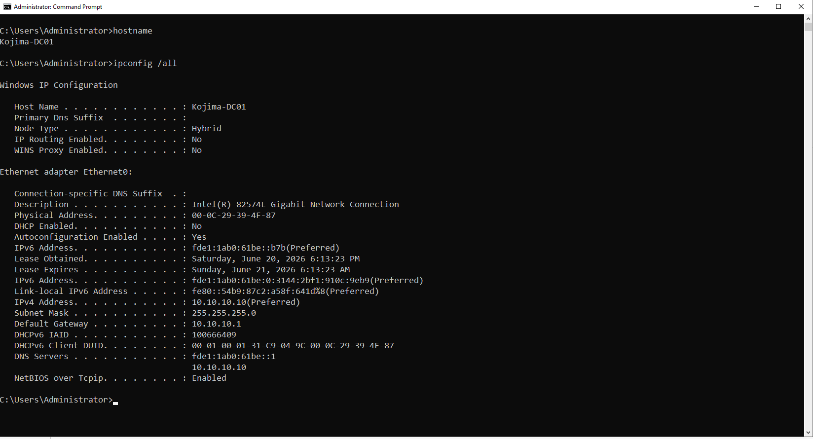
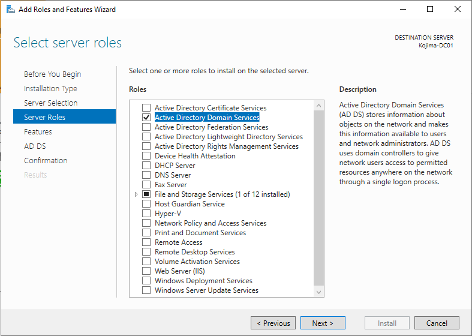
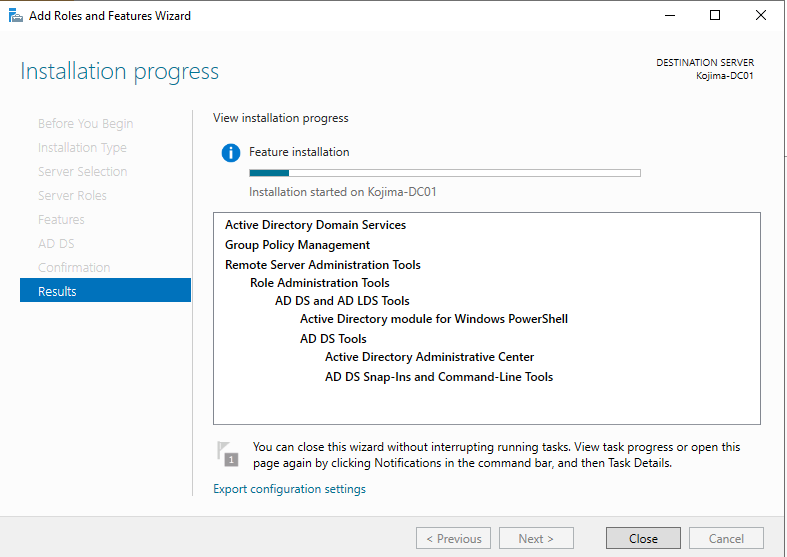
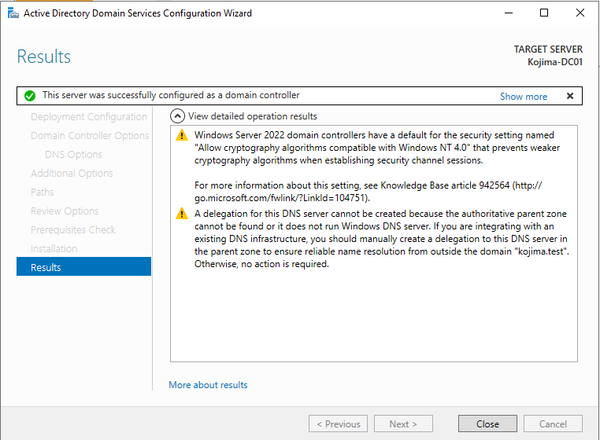
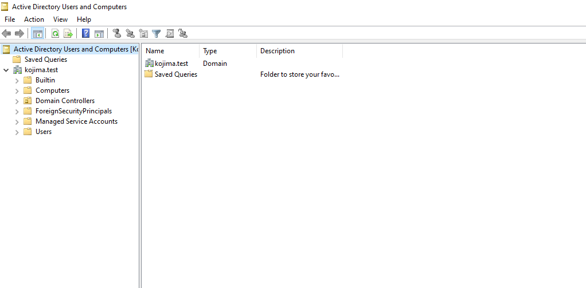
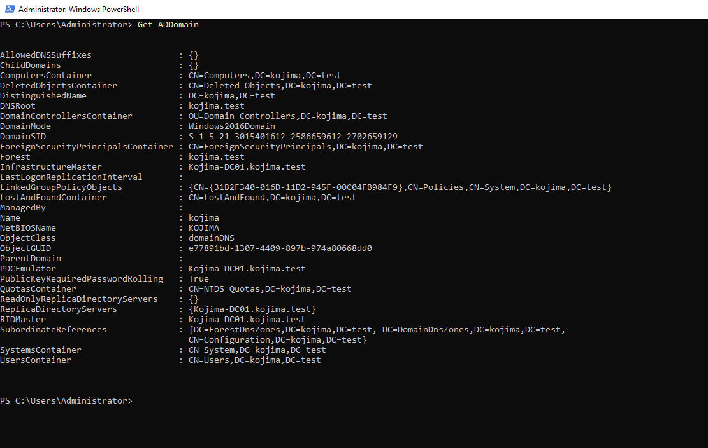

# Domain Controller Setup

<br>

`Hostname:` Kojima-DC01

`IP Address:` 10.10.10.10

`Windows Version:` Windows Server 2022 (Desktop Experience)

<br>

Kojima-DC01 serves as the central domain controller for the lab, hosting Active Directory Domain Services (AD DS). It provides centralized authentication and allows domain users, computers, security groups, and other network resources to be managed from a single location.

<br>

---

<br>

### Virtual Machine Settings

<br>

To keep the lab lightweight while maintaining reliable performance, the domain controller’s virtual hardware is configured with only the resources necessary to support its core services.

- `Processors:` 2 Cores

- `Memory:` 2 Gigabytes

- `Hard Disk:` 60 Gigabytes

- `Network Adapter:` AD-SERVERNET

<br>

---

<br>

### IPv4 Address Configuration

<br>

Network & Internet Settings -> Change Adapter options -> Ethernet0 -> Properties -> Internet Protocol Version 4

`IP Address:` 10.10.10.10

`Subnet Mask:` 255.255.255.0

`Default Gateway:` 10.10.10.1

`Preferred DNS Server:` 10.10.10.10

<br>

*For installing initial Windows Updates, the preferred DNS will point to the gateway but once DNS is configured to the DC then it will change to 10.10.10.10*

<br>

---

<br>

#### Installing Active Directory Domain Services (AD DS)

<br>

**Validating Settings**

Before installing Active Directory Domain Services, I verified the server's hostname and network configuration using:

```powershell

hostname
ipconfig /all

```


{ style="width:40%; display:block; margin:0 ; border-radius:8px;" }

<br>


**Installing AD DS**

Using Server Manager, I installed the Active Directory Domain Services server role.


<br>

{ style="width:40%; display:block; margin:0 ; border-radius:8px;" }

{ style="width:40%; display:block; margin:0 ; border-radius:8px;" }

<br>

---

<br>

#### Promoting server to Domain Controller

<br>

| Setting | Configuration |
|---|---|
| Server | KOJIMA-DC01 | 
| Domain | kojima.test | 
| Deployment Type | New Forest | 
| DNS Server | Installed Automatically | 
| Global Catalog | Enabled | 
| Read-Only Domain Controller | Disabled | 

<br>

DNS was installed alongside Active Directory because domain clients rely on DNS service records to locate domain controllers and other domain services.

The Global Catalog option was also enabled because this server would be the first and primary domain controller in the environment.

<br>

{ style="width:40%; display:block; margin:0 ; border-radius:8px;" }

<br>

---

<br>

### Validation

<br>

I opened Active Directory Users and Computers and confirmed that the `kojima.test` domain and its default containers were available

{ style="width:40%; display:block; margin:0 ; border-radius:8px;" }


<br>


I also confirmed that DNS contained the forward lookup zone and service records created for the domain.

```ps1

Get-ADDomain

```


{ style="width:40%; display:block; margin:0 ; border-radius:8px;" }

<br>

KOJIMA-DC01 was successfully promoted as the first domain controller and DNS server for the kojima.test forest.

With the domain services operational, I could begin designing the organizational unit structure, creating users and security groups, and joining the first workstation to the domain.


