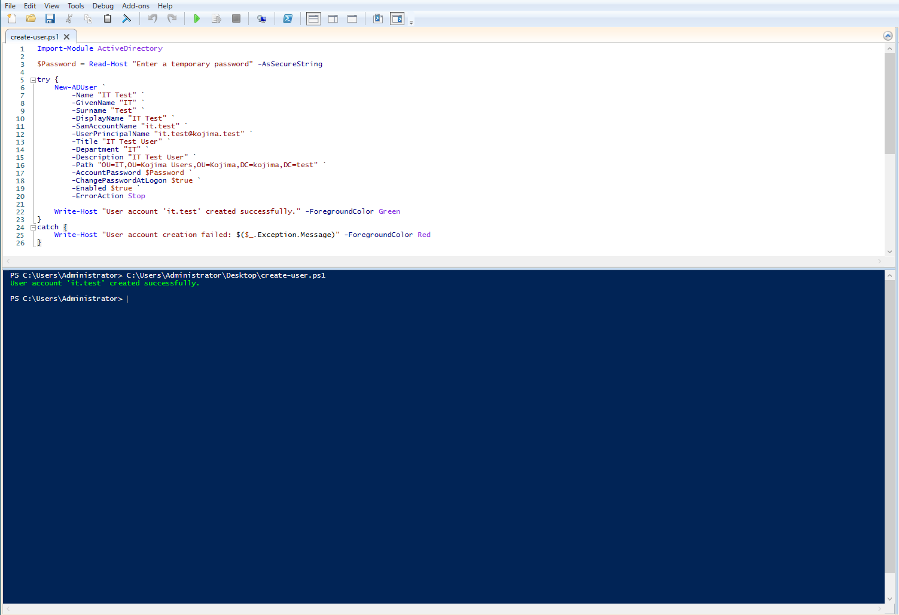
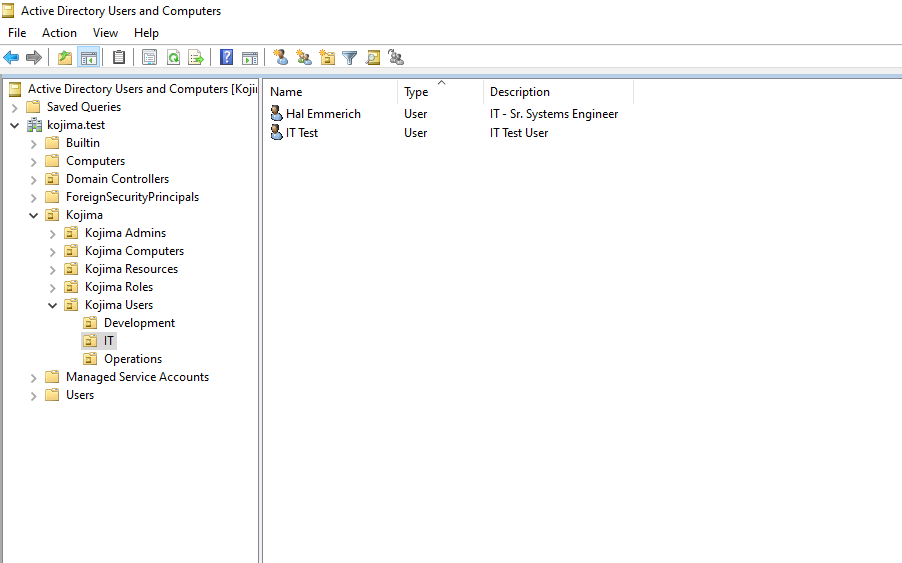
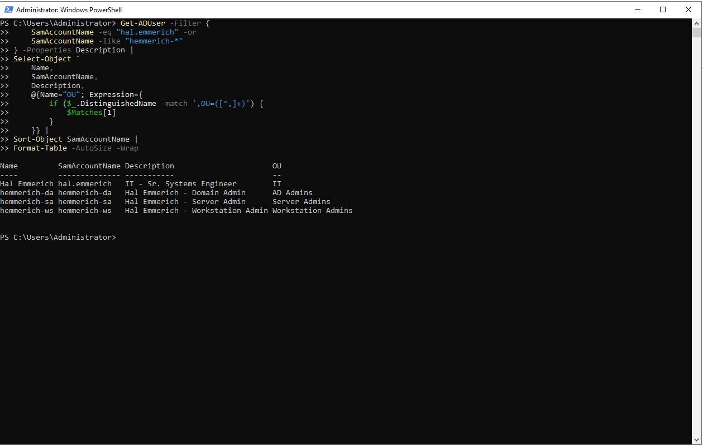

# User Accounts

<br>

To begin the account-provisioning process, the lab will focus on a single user: Hal Emmerich.


{ style="width:20%; display:block; margin:0 ; border-radius:8px;" }

<br>

Within the Metal Gear universe, Hal Emmerich is best known as a highly skilled engineer and technology specialist. In the context of this lab, he will serve as a Senior Systems Engineer within the IT department.

Because this role requires access to multiple systems and administrative functions, Hal will be assigned a standard user account for everyday work alongside separate privileged accounts for workstation, server, and domain-level administration. This approach supports role-based access control while maintaining a clear separation between routine tasks and elevated responsibilities.

<br>

**Account:**

| Username | OU | Description |
|---|---|---|
| hal.emmerich | Kojima Users/IT | Used for day to day activities (web browsing, working on files, etc.) |
| hemmerich-ws | Kojima Admins/Workstation Admins | Used for local administrator actions on workstations |
| hemmerich-sa | Kojima Admins/Server Admins | Used for server administrative activities |
| hemmerich-da | Kojima Admins/Domain Admins | Used for domain administrative actions (creating users, resetting passwords, etc.) |

<br>

---

<br>

### Account Creation

Each account for Huey was created manually through **Active Directory Users and Computers** and placed in the Organizational Unit that corresponds with its intended purpose. Although users can also be created via Powershell:

<br>

**Powershell:**

```

Import-Module ActiveDirectory

$Password = Read-Host "Enter a temporary password" -AsSecureString

try {
    New-ADUser `
        -Name "IT Test" `
        -GivenName "IT" `
        -Surname "Test" `
        -DisplayName "IT Test" `
        -SamAccountName "it.test" `
        -UserPrincipalName "it.test@kojima.test" `
        -Title "IT Test User" `
        -Department "IT" `
        -Description "IT Test User" `
        -Path "OU=IT,OU=Kojima Users,OU=Kojima,DC=kojima,DC=test" `
        -AccountPassword $Password `
        -ChangePasswordAtLogon $true `
        -Enabled $true `
        -ErrorAction Stop

    Write-Host "User account 'it.test' created successfully." -ForegroundColor Green
}
catch {
    Write-Host "User account creation failed: $($_.Exception.Message)" -ForegroundColor Red
}

```

<br>

**Powershell ISE:**

{ style="width:60%; display:block; margin:0 ; border-radius:8px;" }


<br>

**Verifying in Active Directory Computers and Users:**

{ style="width:60%; display:block; margin:0 ; border-radius:8px;" }

<br>


The standard account was placed within the IT department under the `Kojima Users` OU, while the administrative accounts were separated into dedicated OUs beneath `Kojima Admins`.

At this stage, the accounts have only been created and organized. Their permissions will be assigned later through security groups, Group Policy, and delegated Active Directory permissions.


<br>

---

<br>

### Validation

<br>

**Powershell Command:**
```

Get-ADUser -Filter {
    SamAccountName -eq "hal.emmerich" -or
    SamAccountName -like "hemmerich-*"
} -Properties Description |
Select-Object `
    Name,
    SamAccountName,
    Description,
    @{Name="OU"; Expression={
        if ($_.DistinguishedName -match ',OU=([^,]+)') {
            $Matches[1]
        }
    }} |
Sort-Object SamAccountName |
Format-Table -AutoSize -Wrap

```
<br>

**Powershell Command:**

{ style="width:60%; display:block; margin:0 ; border-radius:8px;" }

<br>