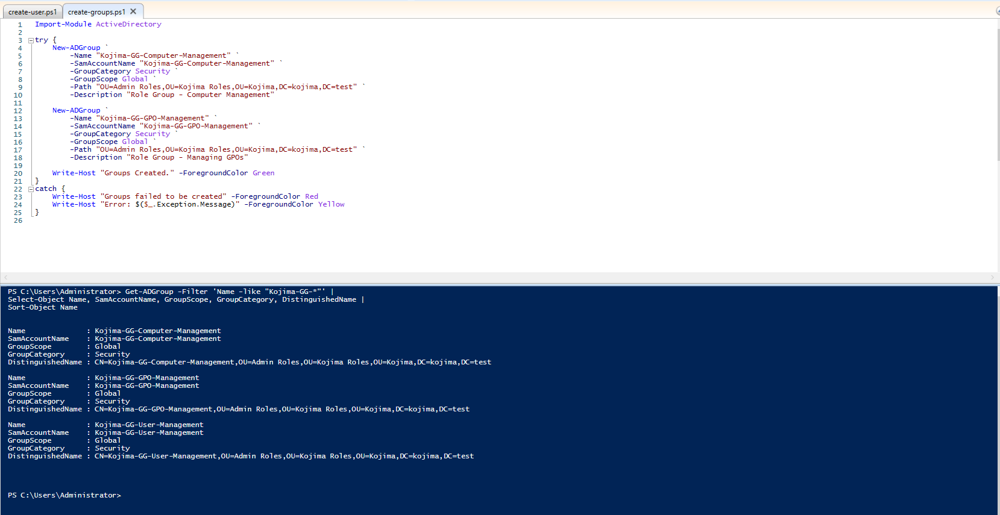
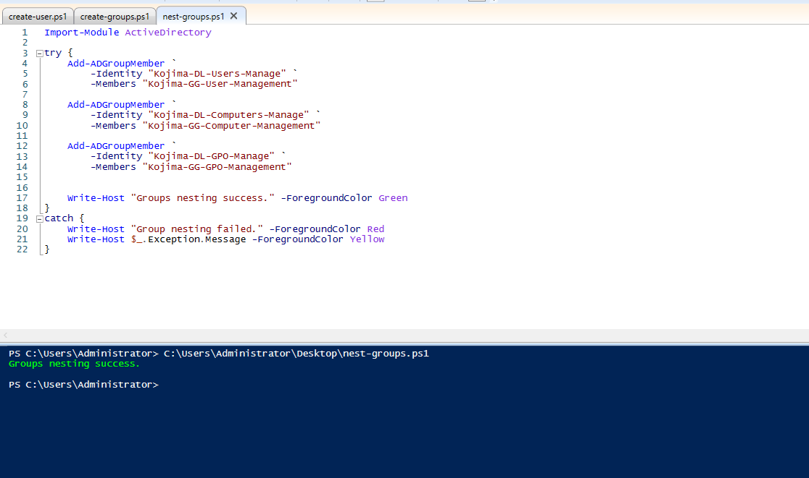
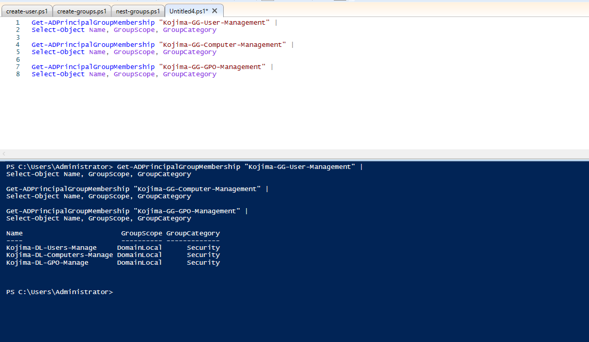
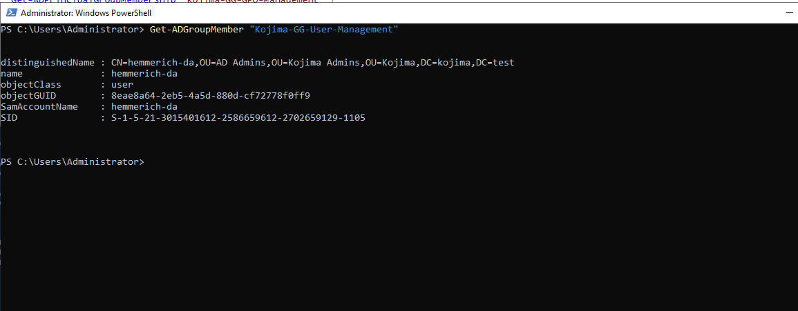
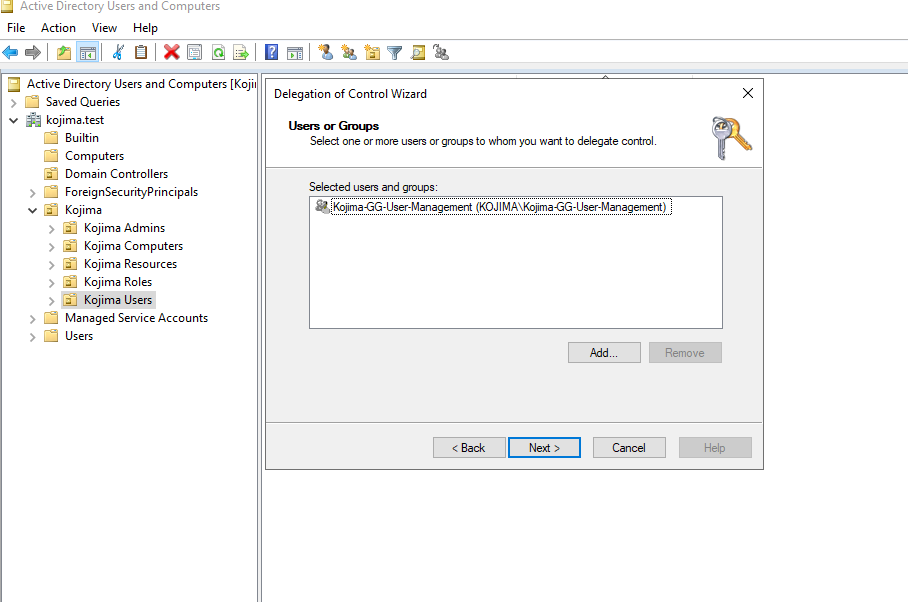
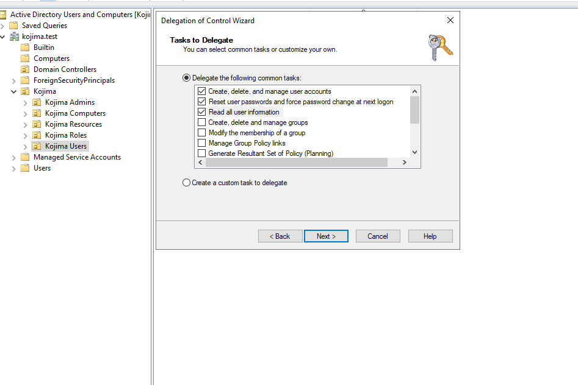

# Domain Administrator Account

<br>

`Account:` hemmerich-da

`Permissions:`

- Create and manage users
- Join Computers to Domain
- Reset Passwords
- Create GPOs

<br>

---

<br>

### Global Groups (Roles)

<br>


All of these roles will be housed in the `Kojima Roles/Admin Roles`

| Name | Permissions |
|---|---|
| Kojima-GG-User-Management | Add, Delete, Manage users and user passwords in Active directory | 
| Kojima-GG-Computer-Management | Add, remove, and manage computer objects in Active directory | 
| Kojima-GG-GPO-Management | Add, delete, and edit Group Policy Objects | 

<br>

The `Kojima-GG-User-Management` global group was created manually via the Active Directory Users and Computers, but roles can also be created using Powershell.

**Creating global groups with Powershell:**

Powershell ISE:

```

Import-Module ActiveDirectory

try {
    New-ADGroup `
        -Name "Kojima-GG-Computer-Management" `
        -SamAccountName "Kojima-GG-Computer-Management" `
        -GroupCategory Security `
        -GroupScope Global `
        -Path "OU=Admin Roles,OU=Kojima Roles,OU=Kojima,DC=kojima,DC=test" `
        -Description "Role Group - Computer Management"

    New-ADGroup `
        -Name "Kojima-GG-GPO-Management" `
        -SamAccountName "Kojima-GG-GPO-Management" `
        -GroupCategory Security `
        -GroupScope Global `
        -Path "OU=Admin Roles,OU=Kojima Roles,OU=Kojima,DC=kojima,DC=test" `
        -Description "Role Group - Managing GPOs"

    Write-Host "Groups Created." -ForegroundColor Green
}
catch {
    Write-Host "Groups failed to be created" -ForegroundColor Red
    Write-Host "Error: $($_.Exception.Message)" -ForegroundColor Yellow
}


```

<br>

**Verifying Group Creation:**

```

Get-ADGroup -Filter 'Name -like "Kojima-GG-*"' |
Select-Object Name, SamAccountName, GroupScope, GroupCategory, DistinguishedName |
Sort-Object Name

```

<br>

**Output:**


{ style="width:60%; display:block; margin:0 ; border-radius:8px;" }

<br>

---

<br>

### Domain Local Groups

<br>

| Name | Permissions |
|---|---|
| Kojima-DL-User-Manage | Grants delegated permission to create, modify, disable, delete, and reset passwords for user accounts within the Kojima Users OU | 
| Kojima-DL-Computer-Manage | Grants delegated permission to create, modify, move, disable, reset, and delete computer objects within the Kojima Computers OU | 
| Kojima-DL-GPO-Manage | Grants permission to create and manage approved Group Policy Objects and link them to authorized Organizational Units | 

<br>

**Creating domain local groups with Powershell:**

*The script is virtually the same as the Global Group's except there were changes made to point the groups to* `Kojima Resources/Domain Access`

```

Import-Module ActiveDirectory

$GroupPath = "OU=Domain Access,OU=Kojima Resources,OU=Kojima,DC=kojima,DC=test"

try {
    New-ADGroup `
        -Name "Kojima-DL-Users-Manage" `
        -SamAccountName "Kojima-DL-Users-Manage" `
        -GroupCategory Security `
        -GroupScope DomainLocal `
        -Path $GroupPath `
        -Description "Permission group for managing users in the Kojima Users OU" `
        -ErrorAction Stop

    New-ADGroup `
        -Name "Kojima-DL-Computers-Manage" `
        -SamAccountName "Kojima-DL-Computers-Manage" `
        -GroupCategory Security `
        -GroupScope DomainLocal `
        -Path $GroupPath `
        -Description "Permission group for managing computers in the Kojima Computers OU" `
        -ErrorAction Stop

    New-ADGroup `
        -Name "Kojima-DL-GPO-Manage" `
        -SamAccountName "Kojima-DL-GPO-Manage" `
        -GroupCategory Security `
        -GroupScope DomainLocal `
        -Path $GroupPath `
        -Description "Permission group for managing approved Group Policy Objects" `
        -ErrorAction Stop

    Write-Host "Domain-local permission groups created successfully." -ForegroundColor Green
}
catch {
    Write-Host "Group creation failed." -ForegroundColor Red
    Write-Host $_.Exception.Message -ForegroundColor Yellow
}

```

<br>

**Verifying Domain Local Group Creation:**

{ style="width:60%; display:block; margin:0 ; border-radius:8px;" }

<br>

---

<br>

### Nesting Groups

For our next step, we will nest the domain local groups with their corresponding global group

```

Add-ADGroupMember `
    -Identity "Kojima-DL-Users-Manage" `
    -Members "Kojima-GG-User-Management"

Add-ADGroupMember `
    -Identity "Kojima-DL-Computers-Manage" `
    -Members "Kojima-GG-Computer-Management"

Add-ADGroupMember `
    -Identity "Kojima-DL-GPO-Manage" `
    -Members "Kojima-GG-GPO-Management"

```

<br>


**PowerShell ISE:**

{ style="width:60%; display:block; margin:0 ; border-radius:8px;" }

<br>


**Validating via PowerShell:**

```

Get-ADPrincipalGroupMembership "Kojima-GG-User-Management" |
Select-Object Name, GroupScope, GroupCategory

Get-ADPrincipalGroupMembership "Kojima-GG-Computer-Management" |
Select-Object Name, GroupScope, GroupCategory

Get-ADPrincipalGroupMembership "Kojima-GG-GPO-Management" |
Select-Object Name, GroupScope, GroupCategory

```

<br>

**PowerShell ISE:**

{ style="width:60%; display:block; margin:0 ; border-radius:8px;" }


<br>

---

<br>

### User Management

<br>

**Adding `hemmerich-da` to User Management Global Group**

```

Add-ADGroupMember `
    -Identity "Kojima-GG-User-Management" `
    -Members "hemmerich-da"

```

{ style="width:60%; display:block; margin:0 ; border-radius:8px;" }

<br>

**Delegating Control**

Active Directory Users and Computers -> Right-Click `Kojima Users` -> Delegate Control

<br>

{ style="width:60%; display:block; margin:0 ; border-radius:8px;" }

<br>

{ style="width:60%; display:block; margin:0 ; border-radius:8px;" }

<br>

---

<br>

### Group and OU management

<br>

---

