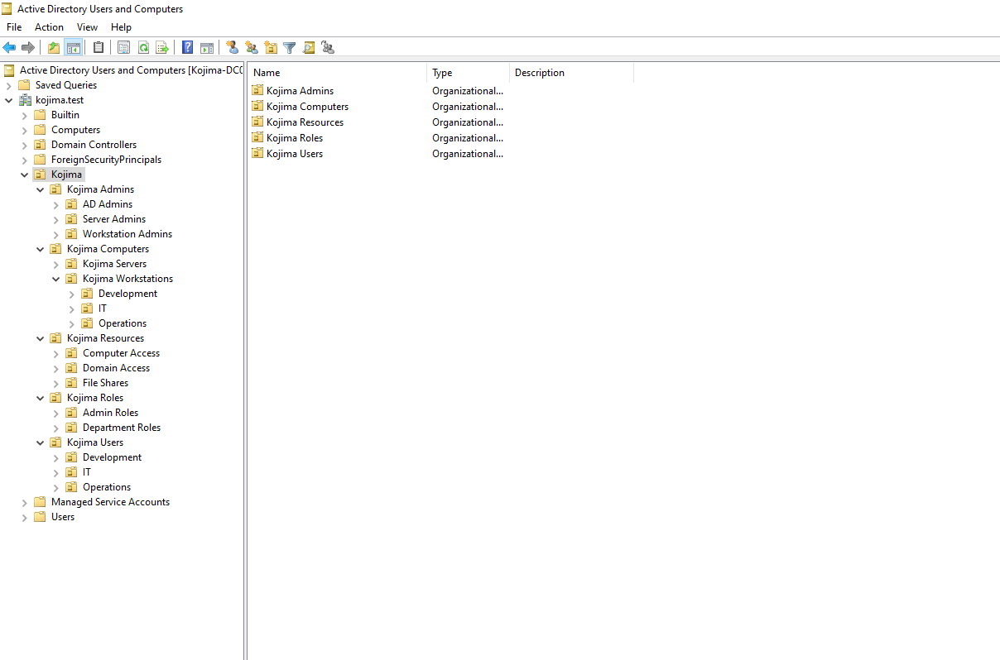

# Organizational Unit Design

<br>

Before creating users, security groups, and administrative permissions, I first designed an Organizational Unit structure for the kojima.test domain.

<br>

The goal was to create a structure that would support:

- Clear separation between standard and privileged accounts
- Role-based access control
- Delegated Active Directory administration
- Targeted Group Policy application
- Department-specific workstation management
- Future expansion of the environment

<br>

---
<br>

#### Final Design

The completed structure separates identities, computers, roles, and resource-access groups into distinct Organizational Units.

<br>

{ style="width:60%; display:block; margin:0 ; border-radius:8px;" }

<br>


**Top Level OUs:**

| OU | Purpose |
|---|---|
| Kojima Users | Contains standard employee accounts | 
| Kojima Admins | Contain dedicated privilged accounts | 
| Kojima Computers | Contains domain-joined workstations and servers | 
| Kojima Roles | Contian Global security groups representing job and administrative roles | 
| Kojima Resources | Contain Domain local groups representing permissions and access to resources | 

<br>


---

<br>

### Identity OUs

```

```

<br>


| OU | Purpose |
|---|---|
| Kojima Users | Contains standard employee accounts | 
| Kojima Admins | Contain dedicated privilged accounts | 
| Kojima Computers | Contains domain-joined workstations and servers | 
| Kojima Roles | Contian Global security groups representing job and administrative roles | 
| Kojima Resources | Contain Domain local groups representing permissions and access to resources | 


<br>

---