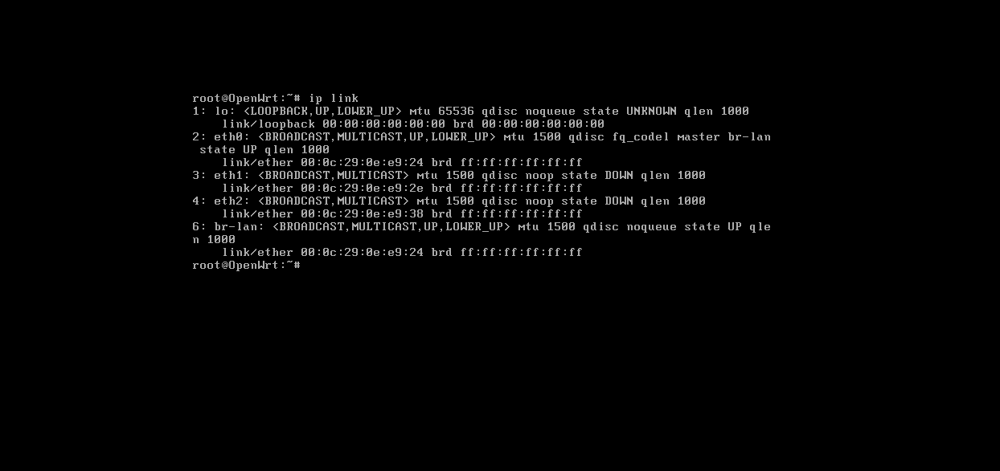
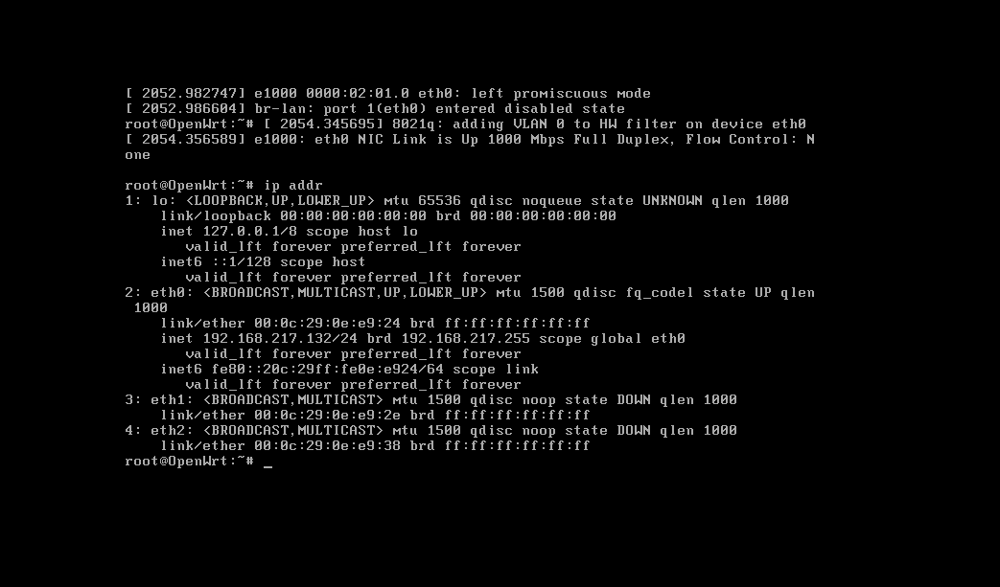
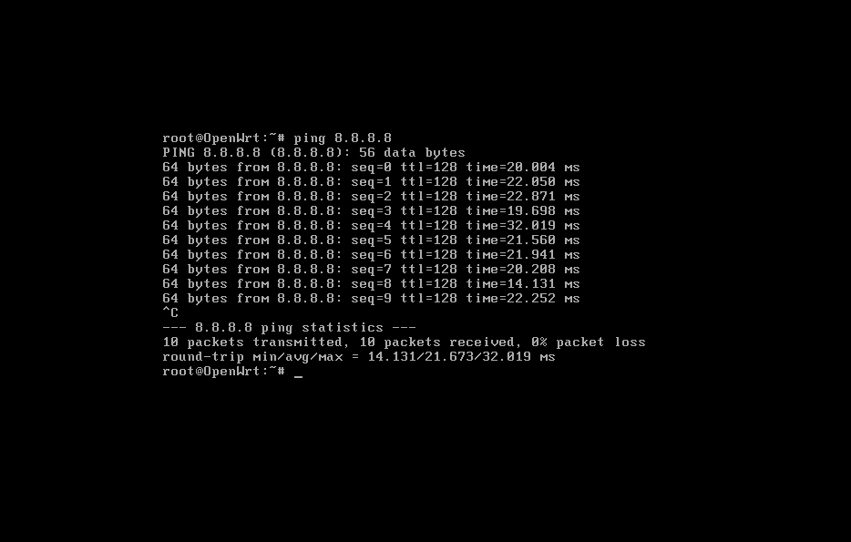

# OpenWRT Configuration

<br>

| Interface | VMware Network | Gateway |
|---|---|---|
| eth0 | VMware NAT | DHCP Client|
| eth1 | AD-SERVERNET | 10.10.10.1/24 |
| eth2 | AD-WORKSTATION | 10.10.20.1/24 |

<br>

**Verifying Interfaces**

```bash
ip link
```
<br>

{ style="width:80%; display:block; margin:0; border-radius:8px;" }


<br>

---

<br>

#### WAN Configuration


**Configuring WAN interface:**

```bash

uci set network.wan='interface' 
uci set network.wan.device='eth0' 
uci set network.wan.proto='dhcp'

```
<br>


By default, OpenWRT assigned eth0 to the br-lan bridge and used it as the initial LAN interface. Because this adapter was intended to provide upstream internet connectivity, it needed to be removed from the LAN bridge and configured as a DHCP-based WAN interface.

<br>

**Removing eth0 from br-lan:**
```bash

uci del_list network.@device[0].ports='eth0'

### Commiting Changes and restarting network services
uci commit network
/etc/init.d/network restart

### Verifying br-lan has been removed
ip addr

```

<br>

**Verifying eth0 is receiving IP Address:**

{ style="width:80%; display:block; margin:0; border-radius:8px;" }


<br>

**Verifying External Connectivity**

{ style="width:80%; display:block; margin:0; border-radius:8px;" }

<br>

---

<br>

#### Server and Workstation Network

<br>

**Server - eth1**

```bash

uci set network.lan.device='eth1' 
uci set network.lan.proto='static' 
uci set network.lan.ipaddr='10.10.10.1' 
uci set network.lan.netmask='255.255.255.0'

```
<br>

**Workstation - eth2**
```bash

uci set network.lan.device='eth2' 
uci set network.lan.proto='static' 
uci set network.lan.ipaddr='10.10.20.1' 
uci set network.lan.netmask='255.255.255.0'

```
<br>


**Commit Changes**
```bash
uci commit network
/etc/init.d/network restart

```

<br>


**Confirm Changes**

```bash

ip link

```

<br>

---
<br>

#### 

```bash

```

<br>

---

<br>


