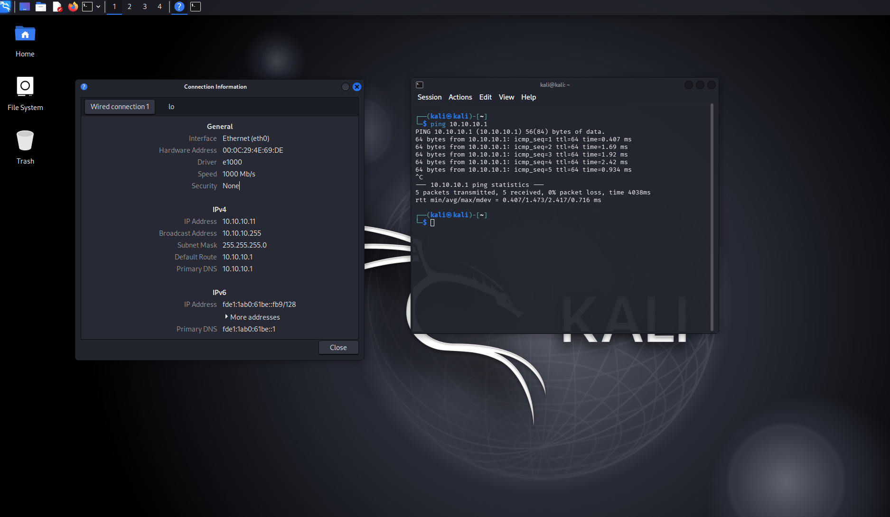
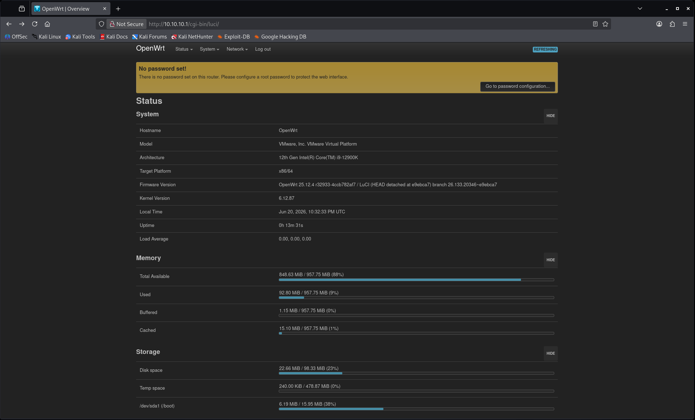
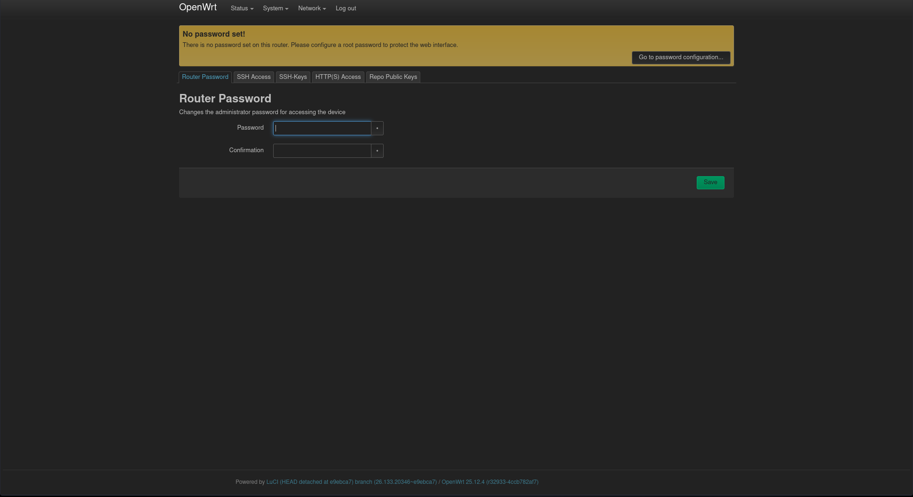
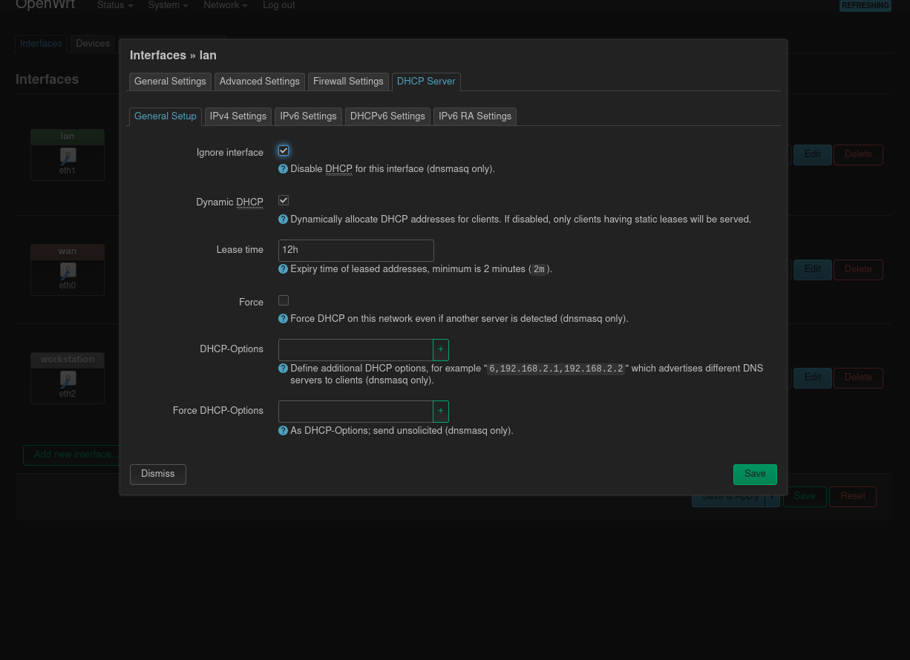
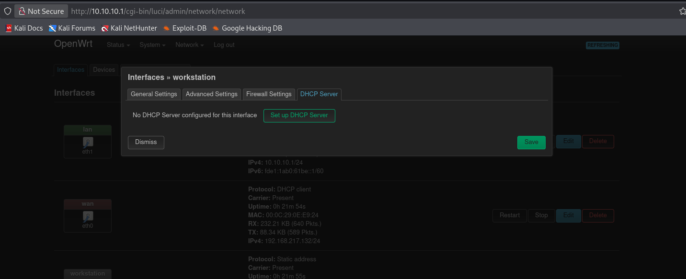
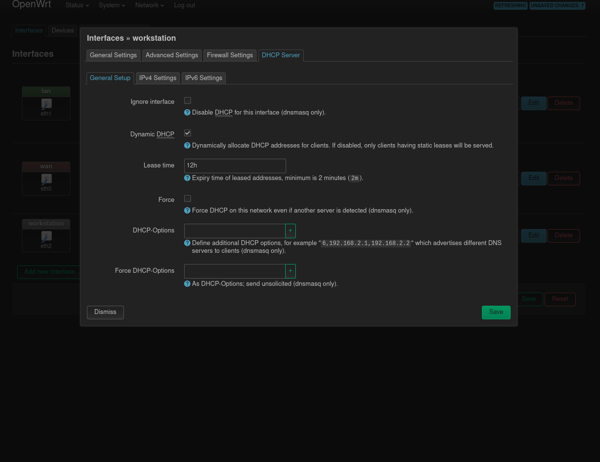
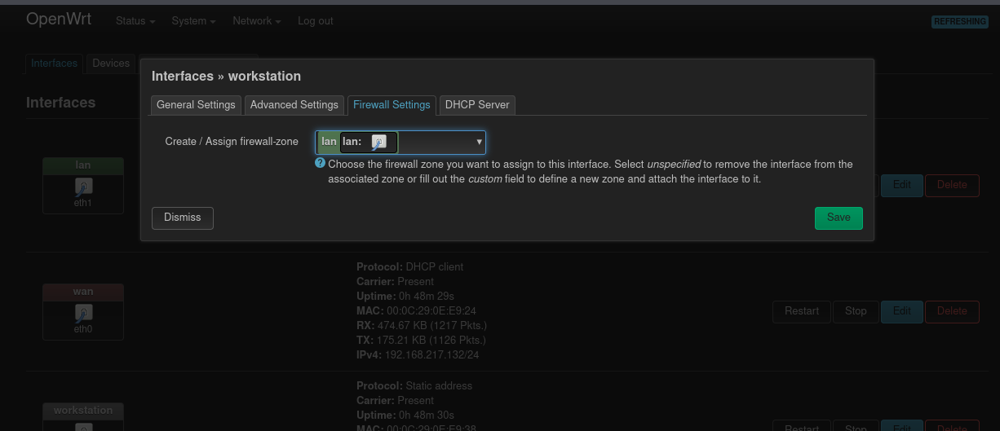
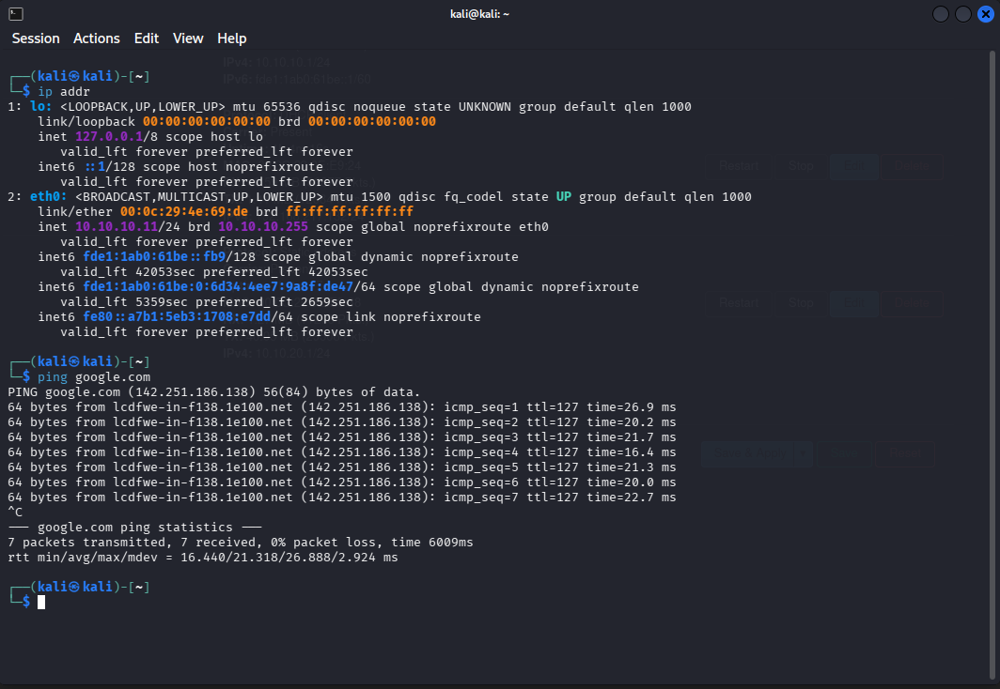
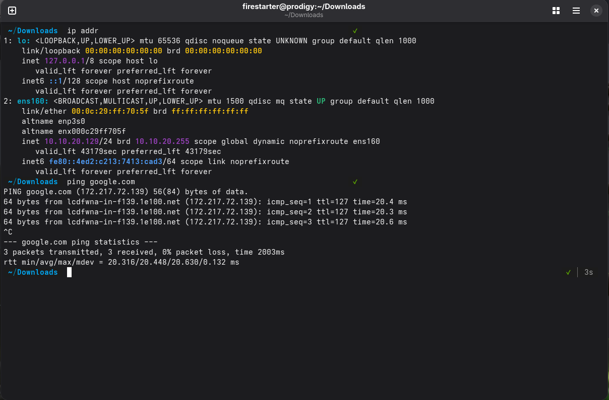

# OpenWRT Web Gui

<br>

`Note`: *I happened to have a Kali Linux Virtual Machine setup on my VMware Workstation, so I am using that to configure OpenWRT via the web GUI.*


<br>


**Virtual Machine Network Settings**

First I attached the virtual adapter for the virtual machine to the `AD-SERVERNET` network then I configured the static IP for the machine inside the OS. After that, I did a simple ping test to make sure the
virtual machine could reach the gateway (10.10.10.1)

{ style="width:40%; display:block; margin:0 ; border-radius:8px;" }

<br>

**Accessing Web GUI**

`IP Address:` 10.10.10.1

To access the web gui, I used firefox and entered the gateway address above. By default, there is no password set on OpenWRT but that can be set upon initial login.

{ style="width:40%; display:block; margin:0 ; border-radius:8px;" }

{ style="width:40%; display:block; margin:0 ; border-radius:8px;" }

<br>

---

<br>

#### Configuring Interfaces and DHCP
<br>

Lan Interface -> Edit -> DHCP Server

Disabling DHCP on server network (LAN Interface)

{ style="width:40%; display:block; margin:0 ; border-radius:8px;" }

<br>

**Enabling DHCP on workstation network (workstation interface)**

Workstation Interface -> Edit -> DHCP Server

Configuring these settings will allow our workstation network to give hosts IP address automatically with a range from `10.10.20.100 - 199`


{ style="width:40%; display:block; margin:0 ; border-radius:8px;" }


{ style="width:40%; display:block; margin:0 ; border-radius:8px;" }

<br>

**Assigning Workstation Interface to firewall zone**

Assigning the interface to the lan zone allowed DHCP traffic from the workstation network to reach OpenWrt.

{ style="width:40%; display:block; margin:0 ; border-radius:8px;" }

<br>

---

<br>

### Verifying Addressing on both Networks

`Note:` *For context, I had a Fedora Workstation Virtual machine that I had to test DHCP connectivity.*


<br>

```bash

ip addr

### Used to test DNS
ping google.com

```
<br>

`Kali VM (Server Network):`

{ style="width:40%; display:block; margin:0 ; border-radius:8px;" }

<br>

`Fedora VM (Workstation Network):`

{ style="width:40%; display:block; margin:0 ; border-radius:8px;" }


<br>

---

<br>