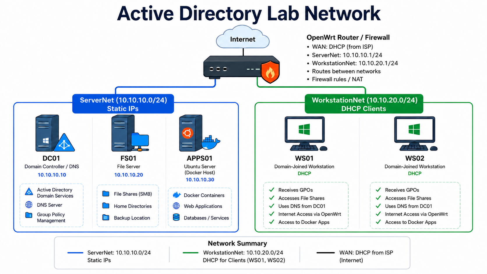

# Networking Overview

 

{ style="width:80%; display:block; margin:0 auto; border-radius:8px;" }

 

### Server Network

The server network in this lab will be used to house the various servers that will host
critical domain resources and services.

 

| Server | Role | IP Address |
|---|---|---|
| Kojima-DC01 | Domain Controller / DNS | 10.10.10.10 |
| Kojima-FS01 | File Server | 10.10.10.20 |
| Kojima-APPS01 | Ubuntu server that will be used to serve Docker container applications to other machines on the network. | 10.10.10.30 |

 
 

---
 

### Workstation Network

This network will house the Windows 11 clients that will be accessing services and
resources from the server network

 

| Server | Role | IP Address |
|---|---|---|
| Kojima-WS01 (Admin Machine)| This machine will be used by a "IT Administrator." They should have the ability to create and manage domain resources and services| DHCP |
| Kojima-WS02 (Standard Machine)| This is for a standard enterprise user that will not have administrator privileges| DHCP |

 
